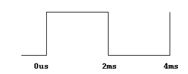
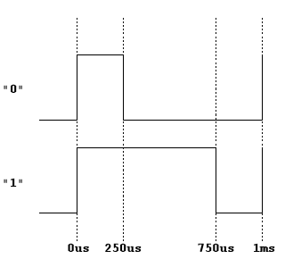
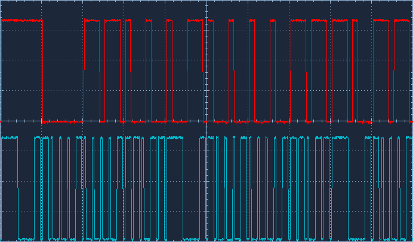

# FPGA Zynq Platform Design

## General parameters of the platform

**Target Board:** G9/G19

**Device:** xc7z010clg400-1

**Vivado Design Suite version:** 2017.4

**CPU clock:** 667 MHz

**DDR clock:** 533 MHz

## List of implemented IP cores

  Name of IP         | Type of IP                | Memory address   | IRQ         | Frequency [MHz]
  ------------------ | ------------------------- | ---------------- | ----------- | -----------------
  SPI\_0             | Xilinx AXI QuadSPI v3.2   | 0x41E00000       | true (61)   | 50
  SPI\_1             | Xilinx AXI QuadSPI v3.2   | 0x41E10000       | true (62)   | 50
  SPI\_2             | Xilinx AXI QuadSPI v3.2   | 0x41E20000       | true (63)   | 50
  SPI\_3             | Xilinx AXI QuadSPI v3.2   | 0x41E30000       | true (64)   | 50
  GPIO\_0            | Xilinx AXI GPIO v2.0      | 0x41200000       | false       | 50
  GPIO\_1            | Xilinx AXI GPIO v2.0      | 0x41210000       | false       | 50
  GPIO\_2            | Xilinx AXI GPIO v2.0      | 0x41220000       | false       | 50
  GPIO\_3            | Xilinx AXI GPIO v2.0      | 0x41230000       | false       | 50
  PWM\_0             | Xilinx AXI Timer v2.0     | 0x42800000       | false       | 50
  PWM\_1             | Xilinx AXI Timer v2.0     | 0x42810000       | false       | 50
  PWM\_2             | Xilinx AXI Timer v2.0     | 0x42820000       | false       | 50
  VID\_0             | VID_gen v1.0 (custom IP)  | 0x43C50000       | false       | 50

## SPI IP cores

**General settings of SPI cores:**
- SPI mode: standard SPI mode (single)
- XIP mode: disabled
- Performance mode: disabled
- Transaction width: 8 (available 8, 16 or 32)
- FIFO depth: 256 (available 0, 16 or 256)
- Frequency ratio: 16x
- Number of slaves: 1 (the value represents number of CS signals for each SPI core)

**SPI channel 1**

  Port   | Port name         | FPGA port   | Direction (FPGA)   | IO level   | Design IP core
  ------ | ----------------- | ----------- | ------------------ | ---------- | ----------------
  1      | SPI1\_LED         | Y18         | OUT                | CMOS33     | GPIO\_1@14
  2      | VID\_PWM          | T20         | OUT                | CMOS33     | VID\_0
  3      | SPI1\_EN\_POWER   | V20         | OUT                | CMOS33     | GPIO\_1@5
  4      | SPI1\_STARTEN     | C20         | OUT                | CMOS18     | GPIO\_2@0
  6      | SPI1\_RESET       | B20         | OUT                | CMOS18     | GPIO\_2@1
  7      | PLUG1             | W20         | IN                 | CMOS33     | GPIO\_0@0
  8      | SPI1\_MISO        | A20         | IN                 | CMOS18     | SPI\_0
  9      | SPI1\_MOSI        | E18         | OUT                | CMOS18     | SPI\_0
  12     | SPI1\_SCK         | E17         | OUT                | CMOS18     | SPI\_0
  13     | SPI1\_CS          | D18         | OUT                | CMOS18     | SPI\_0


**SPI channel 2**

  Port   | Port name         | FPGA port   | Direction (FPGA)   | IO level   | Design IP core
  ------ | ----------------- | ----------- | ------------------ | ---------- | ----------------
  1      | SPI2\_LED         | R16         | OUT                | CMOS33     | GPIO\_1@15
  2      | VID\_PWM          | T14         | OUT                | CMOS33     | VID\_0
  3      | SPI2\_EN\_POWER   | V16         | OUT                | CMOS33     | GPIO\_1@6
  4      | SPI2\_STARTEN     | D19         | OUT                | CMOS18     | GPIO\_2@2
  6      | SPI2\_RESET       | D20         | OUT                | CMOS18     | GPIO\_2@3
  7      | PLUG2             | W16         | IN                 | CMOS33     | GPIO\_0@1
  8      | SPI2\_MISO        | E19         | IN                 | CMOS18     | SPI\_1
  9      | SPI2\_MOSI        | E18         | OUT                | CMOS18     | SPI\_1
  12     | SPI2\_SCK         | F16         | OUT                | CMOS18     | SPI\_1
  13     | SPI2\_CS          | F17         | OUT                | CMOS18     | SPI\_1

Next SPI channels are similar to previous ones and there are not shown
here.

## GPIO IP cores

**Description of GPIO IP cores:**

  IP name       | Port name | Memory address   | Base   | Width   | Direction   | IO level   | Default value
  ------------- | --------- | ---------------- | ------ | ------- | ----------- | ---------- | ---------------
  GPIO\_input   | GPIO\_0   | 0x41200000       | 896    | 10      | IN          | CMOS33     | -
  GPIO\_input1  | GPIO\_3   | 0x41230000       | 895    | 1       | IN          | CMOS18     | -
  GPIO\_output  | GPIO\_1   | 0x41210000       | 867    | 28      | OUT         | CMOS33     | 0x0000000
  GPIO\_output1 | GPIO\_2   | 0x41220000       | 854    | 13      | OUT         | CMOS18     | 0x0000

## Timer (PWM) IP cores

Original design contains special IP cores for PWM generation. In this design a
standard Xilinx IP core Timer with PWM output will be used instead of a
special IP cores (without any description). Also the addresses will be
changed (to avoid misinterpretation), original addresses was 0x43c20000,
0x43c30000 and 0x43c60000.

Outputs from timers are inverted to ensure high speed of fans if timers are not configured.

Example of initialization of timers described by debug Xilinx commands is in file _test\_fan.tcl_

## VID generator IP core

VID generator is custom IP core designed to generate pulses with defined
width according to the communication protocol described on picture in
the scheme.

The communication protocol should be following (text is translated from the
scheme):
> The first synchronization head, and then send 8bit, the voltage level of
0 to 31, a total of 32, send 8bit reverse, repeat.

Synchronization head consists from pulse with width of 4ms and duty
cycle 1:1 :



Data are sent as pulses with width of 1ms with duty cycle 1:3 (log. 0)
or 3:1 (log. 1):



The VID\_gen core is clocked by frequency 50 MHz and contains built-in
divider with ratio 1:12500.

Example of sending value of 0x23 described by debug Xilinx commands (mwr
address data):
```tcl
# send value of 0x23 and enable generation (mask 0x100)
mwr 0x43C50000 0x123
```

The generated signal should look like as in the following
picture (top waveform has timescale of 2ms/div, bottom waveform 5ms/div).



The LSB of data is send first following by inverted data (log.0 -> log.1, log.1 -> log.0).
* 0x23 in MSB first format -> 0b00100011
* 0x23 in LSB first format -> 0b11000100
* 0x23 in LSB first format + inverted data -> 0b11000100_00111011

On the board G19 the VID port is separated for each SPI connector. Currently, the output
from IP core is 4 bits wide and the following FPGA pins are used for VID output:
T20, T14, T15, V15.


## Fan-detect IP cores

IP cores fan-detect are not implemented due to unknown function and also
the resistors on the board are not populated – there is no signal
available in FPGA from fan speed sensor.
Also on board G19 the dedicated pins are connected to separated VID ports on SPI connectors.

## Test script

Simple test script for debug purposes of designed platform was written.
Test is written in TCL for xmd tool (Xilinx Microprocessor Debugger), so
JTAG cable have to be connected to the board. Test is located in root
directory of project and is called _test.tcl_. Test works only in
bare-metal application mode (jumpers on board: J1 on, J2 off) with
disabled MMU – it doesn't work under Linux because MMU doesn't allow
access to physical hardware addresses.

**SPI hash modules must be disconnected before the test is run!**

Test script contains commands for debugger connection to FPGA, loading
bitstream and initialization of the hardware, simple tests of GPIO LEDs,
VID generator, fans and SPI modules.

Test can be run using xmd tool with input TCL script and board name (G9 or G19):
```
> export PATH=$PATH:<path_to_Vivado_directory>/SDK/2017.4/bin
> cd <path_to_test.tcl>
> xmd -tcl test.tcl <board_name>

****** Xilinx Microprocessor Debugger (XMD) Engine
****** XMD v2017.4 (64-bit)
  **** SW Build 2086221 on Fri Dec 15 20:54:30 MST 2017
    ** Copyright 1986-2017 Xilinx, Inc. All Rights Reserved.

Executing user script : test.tcl
Board name: G9/G19
...
```

## Script for bitstream generation

There are prepared TCL scripts for synthesis, implementation and
bitstream generation. Scripts are located in directory _/design_. Main
script is _run.sh_ that calls Vivado tools. Script requires one input argument - name of board.
Currently there are two boards supported: G9 and G19. The process of generation
bitstream is fully automated. You have to set only correct path to
Vivado tools. You have to use the same version of Vivado Design Suite as
is defined on the document begin (version of used IP cores have to
match). Script creates directory
_/design/build\_\<board\_name\>_ with all temporary files. The whole process takes a long
time; depending on the CPU it can be up to 30 minutes. The output files
(bitstream, binary file, hardware description file) are located in
directory _/design/build\_\<board\_name\>/results_. Directory _/design/build\_\<board\_name\>/reports_
contains some reports that should be checked after implementation (e.g.
results of static timing analysis).

## Licenses
The following files or their parts contain source codes that is downloaded from internet:
* design/system_build.tcl, design/system_init.tcl - part of project Parallella Open Hardware [4] licensed under MIT License


## References
[1] Xilinx AXI Quad SPI IP core. Available:
[https://www.xilinx.com/support/documentation/ip\_documentation/axi\_quad\_spi/v3\_2/pg153-axi-quad-spi.pdf](https://www.xilinx.com/support/documentation/ip_documentation/axi_quad_spi/v3_2/pg153-axi-quad-spi.pdf)

[2] Xilinx AXI General Purpose IO (GPIO) IP core. Available:
[https://www.xilinx.com/support/documentation/ip\_documentation/axi\_gpio/v2\_0/pg144-axi-gpio.pdf](https://www.xilinx.com/support/documentation/ip_documentation/axi_gpio/v2_0/pg144-axi-gpio.pdf)

[3] Xilinx AXI Timer v2.0 IP core. Available:
[https://www.xilinx.com/support/documentation/ip\_documentation/axi\_timer/v2\_0/pg079-axi-timer.pdf](https://www.xilinx.com/support/documentation/ip_documentation/axi_timer/v2_0/pg079-axi-timer.pdf)

[4] Parallella Open Hardware. Available:
[https://github.com/parallella/oh](https://github.com/parallella/oh)

